# 技术支持管理网站 - 设计文档

## 📋 概述

本文档详细阐述了技术支持管理网站的架构设计、技术选型、核心业务逻辑和设计决策。

## 🎯 设计目标

### 核心原则
1. **单据化操作**: 所有库存/位置/状态变化只能通过"Action单据+事务"完成，禁止直改多表
2. **统计可计算**: 所有统计来自数据库视图，不允许前端人工合计
3. **安全合规**: 启用RLS，敏感字段加密/脱敏，全链路审计
4. **向后兼容**: 保留现有页面入口与基本交互，增量式改造

### 业务约束
- **码规则**: DNP只允许"专码"；诚研/西铁城允许"专码/通码（二选一）"
- **专码绑定唯一**: 每个专码只能绑定一台打印机，重复绑定直接拒绝并回滚
- **库存准确性**: 通过事务保证库存余额与操作记录的一致性

## 🏗 架构设计

### 整体架构
```
┌─────────────────┐    ┌──────────────────┐    ┌─────────────────┐
│   前端应用       │    │   Supabase       │    │   Edge Functions │
│                │    │                  │    │                │
│ React + TypeScript  │ ◄──► PostgreSQL      │    │ perform_action  │
│ TailwindCSS    │    │ + RLS            │    │ scan_alerts    │
│ React Query    │    │ + Views          │    │                │
└─────────────────┘    └──────────────────┘    └─────────────────┘
```

### 数据层设计

#### 核心表关系
```sql
locations ──┐
           │
           ▼
assets ────┼──► printer_models
           │    consumables
           │    codes (专码/通码)
           │    sim_cards
           │
           ▼
actions ───┼──► stock_ledger (库存账簿)
           │    audit_log (审计日志)
           │    maintenance_records
           │
           ▼
compatibilities (兼容性规则)
```

#### 事务流程

```mermaid
graph TD
    A[用户操作] --> B[ActionModal]
    B --> C[perform_action Edge Function]
    C --> D{兼容性检查}
    D -->|失败| E[回滚 + 错误信息]
    D -->|成功| F[更新assets表]
    F --> G[更新stock_ledger]
    G --> H[写入audit_log]
    H --> I[返回成功]
```


## 💡 核心业务逻辑

### 1. 单据化操作系统

#### 设计理念
- **原子性**: 每个操作必须是完整的事务，要么全部成功，要么全部失败
- **可追溯**: 每个状态变更都有完整的操作记录和审计日志
- **一致性**: 通过数据库约束和事务保证数据一致性

#### 实现方式
```typescript
// 1. 前端提交操作请求
const actionData = {
  action_type: '调拨',
  asset_id: 'printer-001',
  from_location_id: 'warehouse',
  to_location_id: 'showroom',
  by_user: '技术员'
}

// 2. Edge Function处理事务
await supabase.rpc('perform_action_transaction', { p_action: actionData })

// 3. 自动触发：
// - 更新assets.location_id
// - 写入stock_ledger记录
// - 创建audit_log条目
// - 兼容性/约束检查
```

### 2. 兼容性检查系统

#### 业务规则
```typescript
interface CompatibilityRules {
  DNP: {
    allowedCodeTypes: ['专码']
    restrictedCodeTypes: ['通码']
  }
  诚研: {
    allowedCodeTypes: ['专码', '通码']
    mode: '二选一'
  }
  西铁城: {
    allowedCodeTypes: ['专码', '通码']
    mode: '二选一'
  }
}
```

#### 检查流程
1. **静态检查**: 根据品牌和型号查询compatibilities表
2. **动态检查**: 验证专码绑定关系和库存可用性
3. **约束检查**: 确保业务规则不被违反

### 3. 专码绑定管理

#### 绑定规则
- 每个专码只能绑定一台打印机
- 每台打印机只能绑定一个专码
- 通码可以多台设备共享

#### 实现约束
```sql
-- 数据库层约束
ALTER TABLE codes ADD CONSTRAINT unique_specialist_binding
UNIQUE (bound_printer_id) WHERE code_type = '专码';

-- 应用层检查
CREATE FUNCTION check_code_binding(p_code_id UUID, p_printer_id UUID)
RETURNS BOOLEAN AS $$
BEGIN
  -- 检查专码是否已绑定其他设备
  -- 检查设备是否已绑定其他专码
  -- 返回绑定是否允许
END;
$$ LANGUAGE plpgsql;
```

## 🔒 安全设计

### 行级安全策略 (RLS)

#### 角色权限矩阵
| 角色 | locations | assets | actions | audit_log | 说明 |
|------|-----------|--------|---------|-----------|------|
| viewer | SELECT | SELECT (公开字段) | - | - | 只读访问 |
| tech_support | SELECT | SELECT | INSERT/SELECT | SELECT | 技术支持 |
| ops | ALL | ALL | ALL | SELECT | 运营管理 |

#### 数据脱敏
```sql
-- SIM卡ICCID脱敏视图
CREATE VIEW v_sim_public AS
SELECT
  id,
  '****' || RIGHT(iccid, 4) as iccid_masked,
  carrier,
  status,
  -- 其他公开字段
FROM sim_cards;
```

### 审计系统

#### 触发器覆盖
- `assets` - 设备状态变更
- `codes` - 码绑定变更
- `actions` - 操作记录
- `stock_ledger` - 库存变更

#### 审计数据结构
```sql
CREATE TABLE audit_log (
  id UUID PRIMARY KEY,
  actor TEXT NOT NULL,           -- 操作者
  action TEXT NOT NULL,          -- INSERT/UPDATE/DELETE
  table_name TEXT NOT NULL,      -- 表名
  row_id UUID,                   -- 记录ID
  before JSONB,                  -- 变更前数据
  after JSONB,                   -- 变更后数据
  at_time TIMESTAMPTZ DEFAULT NOW()
);
```

## 📊 统计与监控

### 统计视图设计

#### 实时统计
```sql
-- 打印机状态统计
CREATE VIEW v_printer_counts AS
SELECT
  brand,
  model,
  status,
  location_name,
  COUNT(*) as count
FROM assets a
JOIN printer_models pm ON a.model_id = pm.id
JOIN locations l ON a.location_id = l.id
WHERE a.asset_type = '打印机'
GROUP BY brand, model, status, location_name;

-- 库存水平监控
CREATE VIEW v_stock_levels AS
WITH latest_balance AS (
  SELECT DISTINCT ON (item_type, item_id, location_id)
    item_type, item_id, location_id, balance
  FROM stock_ledger
  ORDER BY item_type, item_id, location_id, created_at DESC
)
SELECT
  lb.*,
  l.name as location_name,
  CASE
    WHEN lb.balance < 10 THEN '低库存'
    WHEN lb.balance < 20 THEN '正常'
    ELSE '充足'
  END as stock_status
FROM latest_balance lb
JOIN locations l ON lb.location_id = l.id;
```

### 性能优化

#### 索引策略
- 核心查询字段的复合索引
- 时间序列数据的分区索引
- 全文搜索索引

#### 缓存策略
- React Query缓存前端数据
- Supabase自动缓存查询结果
- CDN缓存静态资源

## 🧪 测试策略

### 测试金字塔

#### 单元测试 (Vitest)
- **兼容性逻辑**: 各种品牌和码类型组合
- **事务逻辑**: 成功/失败场景的数据一致性
- **业务规则**: 专码绑定、库存计算等

#### 集成测试 (Playwright)
- **端到端流程**: 从操作发起到数据更新的完整链路
- **错误处理**: 兼容性检查失败、库存不足等场景
- **数据联动**: 操作后统计数据的实时更新

#### 组件测试 (Storybook)
- **UI组件**: 各种状态和交互场景
- **表单验证**: 输入验证和错误提示
- **用户体验**: 加载状态、成功/失败反馈

### 测试数据管理
- 独立的测试数据库环境
- 可重复的种子数据脚本
- 测试后的数据清理机制

## 🚀 部署与运维

### 环境管理

#### 环境隔离
- **开发环境**: 本地开发，模拟数据
- **测试环境**: 自动化测试，真实数据结构
- **生产环境**: 实际业务数据，性能监控

#### 配置管理
```env
# 数据库配置
VITE_SUPABASE_URL=https://project.supabase.co
VITE_SUPABASE_ANON_KEY=eyJ...

# 功能开关
VITE_ENABLE_AUDIT=true
VITE_ENABLE_ALERTS=true

# 性能配置
VITE_QUERY_STALE_TIME=300000
VITE_QUERY_CACHE_TIME=600000
```

### 监控与告警

#### 关键指标
- **业务指标**: 设备利用率、库存周转率、故障率
- **技术指标**: 响应时间、错误率、数据库性能
- **用户指标**: 操作成功率、页面加载时间

#### 告警规则
- 低库存自动告警（可配置阈值）
- 操作失败率超过5%
- 数据库连接异常
- Edge Function执行失败

## 🔄 扩展性设计

### 模块化架构
- **松耦合**: 各功能模块独立开发和部署
- **插件化**: 新的设备类型和操作类型易于扩展
- **API优先**: 标准化的数据接口

### 未来扩展点
1. **多租户支持**: 支持多个组织的独立数据
2. **移动端应用**: React Native或PWA
3. **第三方集成**: ERP系统、采购系统对接
4. **AI功能**: 故障预测、库存优化建议

## 📚 技术决策记录

### 为什么选择单据化操作？

#### 问题
原有系统直接修改多个表，导致：
- 数据不一致风险
- 操作无法回滚
- 审计记录不完整
- 并发冲突难以处理

#### 解决方案
采用事务化的单据操作：
- 所有变更通过统一的`perform_action`函数
- 原子性事务保证数据一致性
- 完整的操作记录和审计日志
- 清晰的业务逻辑和错误处理

#### 权衡
- **优势**: 数据一致性、可审计性、可维护性
- **劣势**: 开发复杂度略高、性能轻微影响
- **决策**: 长期收益远大于短期成本

### 为什么选择数据库视图而非前端计算？

#### 问题
前端计算统计数据存在：
- 数据准确性风险
- 性能问题（大数据量）
- 重复计算逻辑
- 缓存一致性难题

#### 解决方案
使用数据库物化视图：
- 数据库层保证计算准确性
- 利用数据库优化能力
- 统一的计算逻辑
- 自动缓存和更新

#### 权衡
- **优势**: 准确性、性能、一致性
- **劣势**: 数据库复杂度增加
- **决策**: 数据准确性是首要考虑

## 🎯 参数化调度系统设计

### 设计理念

参数化调度系统采用**声明式（Declarative）→ 生成式（Generated）** 的设计模式，通过单一参数源驱动多表联动更新。

#### 核心思想

```
单一参数源（spec） → 差异计算（diff） → 自动生成动作（actions） → 联动更新（cascading updates）
```

### 为什么需要参数化调度？

#### 问题背景

传统的命令式操作流程：
1. 用户手动创建"借用"单据
2. 用户手动创建"调拨"单据
3. 用户手动创建"耗材领用"单据
4. 用户手动创建"码绑定"动作
5. 如果目的地改变，需要重新执行上述所有步骤

**痛点**：
- 操作繁琐，容易遗漏
- 数据一致性难以保证
- 修改参数需要手动补差或回滚
- 缺乏整体视图和审计追溯

#### 解决方案

声明式参数化调度：
1. 用户配置一次调度参数（目的地、设备清单、耗材、码）
2. 系统自动生成所有必要的动作
3. 修改参数时，系统自动计算差异并补差
4. 支持一键回滚整个调度单的所有影响

**优势**：
- 操作简化，一次配置完成
- 事务化执行，数据一致性有保证
- 自动差异计算，支持参数迭代
- 完整审计追踪，可回滚

### 架构设计

#### 数据模型

```sql
dispatch_orders (调度单)
├── id: UUID
├── spec: JSONB                    -- 唯一参数源
│   ├── destination_location_id
│   ├── source_location_id
│   ├── items[]                    -- 携带资产
│   ├── consumables[]              -- 携带耗材
│   ├── codes[]                    -- 绑定码
│   └── apply_mode                 -- draft | apply
├── status: ENUM                   -- draft | applied | reverted
└── effective_at: TIMESTAMPTZ

dispatch_generated_actions (生成动作关联)
├── dispatch_id: UUID FK
├── action_id: UUID FK
├── fingerprint: TEXT              -- 幂等键
└── operation: TEXT                -- add | revert
```

#### 处理流程

```
┌─────────────────┐
│  用户修改 spec   │
└────────┬────────┘
         │
         ▼
┌─────────────────┐
│ Edge Function   │
│ apply_dispatch  │
└────────┬────────┘
         │
         ▼
┌─────────────────────────────────┐
│ 1. 查询当前状态                   │
│    - assets.location_id          │
│    - stock_ledger.balance        │
│    - codes.bound_printer_id      │
└────────┬────────────────────────┘
         │
         ▼
┌─────────────────────────────────┐
│ 2. 计算差异 (diff)                │
│    - added: 需要新增的动作         │
│    - reverted: 需要撤销的动作      │
└────────┬────────────────────────┘
         │
         ▼
┌─────────────────────────────────┐
│ 3. 事务执行                       │
│    - 创建 actions                 │
│    - 更新 assets.location_id      │
│    - 插入 stock_ledger            │
│    - 更新 codes.bound_printer_id  │
│    - 记录 dispatch_generated_actions │
└────────┬────────────────────────┘
         │
         ▼
┌─────────────────┐
│ 4. 更新状态      │
│ status = applied │
└─────────────────┘
```

### 幂等性设计

#### Fingerprint 计算

```typescript
function generateFingerprint(params: {
  dispatch_id: string;
  action_type: string;
  asset_id?: string;
  from?: string;
  to?: string;
  extra?: any;
}): string {
  const sorted = JSON.stringify(params, Object.keys(params).sort());
  return btoa(sorted);  // Base64 编码
}
```

#### 幂等保证

- 每个动作生成唯一的 `fingerprint`
- `dispatch_generated_actions` 表对 `(dispatch_id, fingerprint)` 唯一约束
- 重复执行时，已存在的 fingerprint 会被跳过
- 确保幂等：多次应用相同 spec 不会产生重复副作用

### 差异计算算法

```typescript
function calculateDiff(current: State, target: State): Diff {
  const added = [];
  const reverted = [];

  // 资产位置差异
  for (const item of target.items) {
    const currentLocation = current.assets[item.asset_id]?.location_id;
    if (currentLocation !== target.destination_location_id) {
      added.push({
        action_type: '调拨',
        asset_id: item.asset_id,
        from_location_id: currentLocation,
        to_location_id: target.destination_location_id
      });
    }
  }

  // 耗材差异
  for (const consumable of target.consumables) {
    const currentQty = current.stock[consumable.consumable_id] || 0;
    const delta = consumable.qty - currentQty;
    if (delta > 0) {
      added.push({
        action_type: '耗材领用',
        consumable_id: consumable.consumable_id,
        qty: delta
      });
    } else if (delta < 0) {
      added.push({
        action_type: '耗材归还',
        consumable_id: consumable.consumable_id,
        qty: -delta
      });
    }
  }

  // 码绑定差异
  for (const code of target.codes) {
    const currentBinding = current.codes[code.code_id]?.bound_printer_id;
    if (currentBinding !== code.bind_to_printer_id) {
      added.push({
        action_type: 'bind_code',
        code_id: code.code_id,
        printer_id: code.bind_to_printer_id
      });
    }
  }

  return { added, reverted };
}
```

### 兼容性验证

#### 验证时机

在差异计算阶段，对每个码绑定动作进行验证：

```typescript
async function validateCodeBinding(code_id: string, printer_id: string) {
  // 1. 查询码类型
  const code = await getCode(code_id);

  // 2. 查询打印机型号
  const printer = await getAsset(printer_id);
  const model = await getPrinterModel(printer.model_id);

  // 3. 查询兼容性规则
  const compatibility = await getCompatibility(model.id);

  // 4. 验证规则
  if (compatibility.code_type === '专码' && code.code_type !== '专码') {
    throw new Error(`${model.brand} 只支持专码`);
  }

  // 5. 专码唯一性检查
  if (code.code_type === '专码' && code.bound_printer_id &&
      code.bound_printer_id !== printer_id) {
    throw new Error('专码已绑定到其他打印机');
  }
}
```

### 回滚机制

#### 回滚流程

```typescript
async function revertDispatch(dispatch_id: string) {
  // 1. 查询所有生成的动作
  const generatedActions = await getDispatchGeneratedActions(dispatch_id);

  // 2. 逐条反向动作
  for (const ga of generatedActions.reverse()) {
    const action = await getAction(ga.action_id);

    // 3. 生成反向动作
    const reverseAction = {
      action_type: getReverseActionType(action.action_type),
      from_location_id: action.to_location_id,
      to_location_id: action.from_location_id,
      // ... 其他字段
    };

    // 4. 执行反向动作
    await performAction(reverseAction);
  }

  // 5. 更新调度单状态
  await updateDispatchOrder(dispatch_id, { status: 'reverted' });
}

function getReverseActionType(actionType: string): string {
  const reverseMap = {
    '调拨': '调拨',      // 互为反向
    '借用': '归还',
    '耗材领用': '耗材归还',
    '安装': '拆卸'
  };
  return reverseMap[actionType] || actionType;
}
```

### 性能优化

#### 批量查询

```typescript
// 避免 N+1 查询
const assets = await supabase
  .from('assets')
  .select('*')
  .in('id', item_ids);  // 一次查询所有资产

const stock = await supabase
  .from('stock_ledger')
  .select('item_id, SUM(delta) as balance')
  .in('item_id', consumable_ids)
  .groupBy('item_id');  // 一次查询所有库存
```

#### 事务优化

```sql
BEGIN;
  -- 所有动作在单一事务中执行
  INSERT INTO actions (...) RETURNING id;
  UPDATE assets SET location_id = ... WHERE id = ...;
  INSERT INTO stock_ledger (...);
  INSERT INTO dispatch_generated_actions (...);
COMMIT;
```

### 扩展性设计

#### 支持模板

```typescript
interface BundleTemplate {
  id: string;
  name: string;
  default_items: DispatchSpec['items'];
  default_consumables: DispatchSpec['consumables'];
}

// 用户可以从模板创建调度单
const spec = loadTemplate('template-id');
// 再进行微调
spec.destination_location_id = 'new-location';
```

#### 支持预览

```typescript
// apply_mode = 'preview' 时不执行，只返回差异
const preview = await applyDispatchOrder(dispatch_id, 'preview');
// preview: { actions_to_add: [...], actions_to_revert: [...] }
```

### 安全性考虑

#### 权限控制

```sql
-- RLS 策略
CREATE POLICY "tech_support 可写" ON dispatch_orders
  FOR ALL USING (auth.uid() IN (SELECT id FROM users WHERE role = 'tech_support'));

CREATE POLICY "viewer 只读" ON dispatch_orders
  FOR SELECT USING (auth.uid() IN (SELECT id FROM users WHERE role IN ('tech_support', 'viewer')));
```

#### 审计追踪

```typescript
// 所有调度单变更自动记录到 audit_log
CREATE TRIGGER audit_dispatch_orders
  AFTER INSERT OR UPDATE ON dispatch_orders
  FOR EACH ROW EXECUTE FUNCTION log_audit();
```

### 测试策略

#### 单元测试

```typescript
describe('calculateDiff', () => {
  it('should generate 调拨 action when location changes', () => {
    const current = { assets: { 'asset-1': { location_id: 'loc-A' } } };
    const target = { destination_location_id: 'loc-B', items: [{ asset_id: 'asset-1' }] };
    const diff = calculateDiff(current, target);

    expect(diff.added).toContainEqual({
      action_type: '调拨',
      asset_id: 'asset-1',
      from_location_id: 'loc-A',
      to_location_id: 'loc-B'
    });
  });
});
```

#### 集成测试

```typescript
describe('apply_dispatch', () => {
  it('should rollback on compatibility error', async () => {
    // 1. 创建调度单（DNP + 通码，应该失败）
    const dispatch = await createDispatch({
      items: [{ asset_id: 'dnp-printer' }],
      codes: [{ code_id: 'code-通码', bind_to_printer_id: 'dnp-printer' }]
    });

    // 2. 应用调度单
    const result = await applyDispatch(dispatch.id);

    // 3. 验证失败和回滚
    expect(result.success).toBe(false);
    expect(result.error).toContain('DNP 只支持专码');

    // 4. 确认数据库状态未改变
    const printer = await getAsset('dnp-printer');
    expect(printer.location_id).toBe(originalLocation);
  });
});
```

### 设计决策记录

#### 为什么使用 JSONB 存储 spec？

**优势**：
- 灵活性：spec 结构可以演进，无需频繁修改表结构
- 原子性：spec 作为单一参数源，修改即为原子操作
- 查询能力：PostgreSQL 的 JSONB 支持索引和查询

**劣势**：
- 类型约束较弱，需要前端和 Edge Function 校验
- 查询性能略低于独立列

**决策**：灵活性和原子性优先，性能影响可接受

#### 为什么使用 Edge Function 而不是 Database Function？

**优势**：
- 更好的代码组织和测试
- 支持 TypeScript 类型安全
- 更容易与前端共享类型定义
- 便于调试和日志记录

**劣势**：
- 网络延迟略高
- 需要额外部署和维护

**决策**：可维护性和类型安全优先

#### 为什么记录 fingerprint 而不是重复检测？

**优势**：
- 幂等性保证：数据库层面唯一约束
- 性能：无需每次查询所有历史动作
- 审计：可追溯每个动作的来源

**劣势**：
- 额外存储开销（可接受）

**决策**：幂等性是核心需求，额外存储开销可接受

## 📖 参考资料

- [Supabase Documentation](https://supabase.com/docs)
- [React Query Documentation](https://tanstack.com/query/latest)
- [PostgreSQL Row Level Security](https://www.postgresql.org/docs/current/ddl-rowsecurity.html)
- [Database Transaction Best Practices](https://www.postgresql.org/docs/current/transaction-iso.html)
- [Idempotency in Distributed Systems](https://stripe.com/blog/idempotency)
- [Declarative vs Imperative Programming](https://ui.dev/imperative-vs-declarative-programming)

---

本设计文档将随着系统演进持续更新，确保设计决策的可追溯性和系统的可维护性。