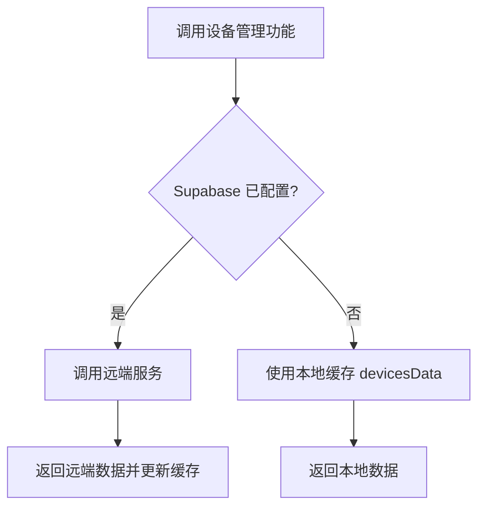

# 设备管理逻辑流程图

本流程图基于项目中的设备数据与服务实现（src/data/devices.ts 与 src/services/deviceService.ts），涵盖设备列表获取、单设备获取、创建设备、更新设备、删除设备、以及维护日志添加等核心流程。系统在 Supabase 配置存在时优先使用远端数据库，否则自动降级为本地数据缓存模式。

## 总览：设备管理入口流程（含远端/本地降级）


## 获取设备列表 getDevices
```mermaid
flowchart TD
    A[调用 getDevices] --> B{Supabase 已配置?}
    B -- 是 --> C[fetchDevices()]
    C --> D[查询 devices 表]
    D --> E[查询 maintenance_logs 表]
    E --> F[查询 issues 表]
    F --> G[mapRowToDevice: 将行数据合并日志/故障并转为 Device]
    G --> H[返回设备数组并更新 devicesData 缓存]
    B -- 否 --> I[返回 devicesData 作为降级结果]
```

## 获取单设备详情 getDevice
```mermaid
flowchart TD
    A[调用 getDevice(deviceId)] --> B{Supabase 已配置?}
    B -- 是 --> C[fetchDevice(deviceId)]
    C --> D[查询 devices 表: 指定 id 单行]
    D --> E[查询 maintenance_logs 表: 按 device_id]
    E --> F[查询 issues 表: 按 device_id]
    F --> G[mapRowToDevice: 合并后返回 Device]
    B -- 否 --> H[在 devicesData 中查找对应 id 并返回]
```

## 创建设备 createDevice
```mermaid
flowchart TD
    A[调用 createDevice(newDevice)] --> AA[生成 deviceId 并构造 Device 对象]
    AA --> B{Supabase 已配置?}
    B -- 是 --> C[createDeviceRecord: mapDeviceToRow 转换并插入 devices 表]
    C --> D[插入成功后 fetchDevice(createdId)]
    D --> E[获取完整 Device(含日志/故障为空集合)] --> F[push 到 devicesData 并返回]
    B -- 否 --> G[直接 push 到 devicesData 并返回]
```

## 更新设备 updateDevice
```mermaid
flowchart TD
    A[调用 updateDevice(deviceId, updates)] --> B{Supabase 已配置?}
    B -- 是 --> C[updateDeviceData: mapDeviceToRow 转换并更新 devices 表]
    C --> D{更新成功?}
    D -- 是 --> E[返回 true]
    D -- 否 --> F[转入本地更新]
    B -- 否 --> F[本地更新 devicesData 指定项并返回 true]
```

## 删除设备 deleteDevice
```mermaid
flowchart TD
    A[调用 deleteDevice(deviceId)] --> B{Supabase 已配置?}
    B -- 是 --> C[deleteDeviceData: 删除 devices 表对应 id]
    C --> D{删除成功?}
    D -- 否 --> E[返回 false]
    D -- 是 --> F[继续本地删除]
    B -- 否 --> F[在 devicesData 中查找并 splice 删除]
    F --> G{找到设备?}
    G -- 是 --> H[删除并返回 true]
    G -- 否 --> I[返回 false]
```

## 添加维护日志 addMaintenanceLog
```mermaid
flowchart TD
    A[调用 addMaintenanceLog(deviceId, log)] --> B{Supabase 已配置?}
    B -- 是 --> C[addMaintenanceLogData: 插入 maintenance_logs 表]
    C --> D{插入成功?}
    D -- 是 --> E[返回 true]
    D -- 否 --> F[本地追加]
    B -- 否 --> F[在 devicesData 中找到设备并 push log]
    F --> G{找到设备?}
    G -- 是 --> H[追加日志并返回 true]
    G -- 否 --> I[返回 false]
```

## 数据映射函数
```mermaid
flowchart TD
    subgraph 映射
    A[mapRowToDevice(row, logs, issues)]
    A --> B[字段映射: id/name/model/serial/...]
    B --> C[printer 对象映射: model/paper/connect/paperStock/ink CMYK]
    C --> D[images: 字段为 JSON 字符串时解析为数组]
    D --> E[组合 logs/issues 为 Device.logs/Device.issues]
    E --> F[返回 Device]

    G[mapDeviceToRow(device)]
    G --> H[将 Device/Partial<Device> 转换为数据库列]
    H --> I[处理 printer 与 ink 的子字段]
    I --> J[images 序列化为 JSON 字符串]
    J --> K[附加 updated_at 时间戳]
    K --> L[返回 row 以供 insert/update]
    end
```

## 关键点总结
- 远端优先，本地降级：所有入口均先判断 Supabase 配置状态；远端失败时回退到本地缓存 devicesData。
- 设备与日志/故障数据分表存储：获取流程通过设备表、维护日志表、故障表联合查询，再由 mapRowToDevice 合并结构。
- 写入更新采用 mapDeviceToRow：避免直接写入复杂对象结构，统一转换为数据库字段。
- 缓存保持一致：远端成功返回后更新 devicesData，保证后续本地降级有可用数据。
```